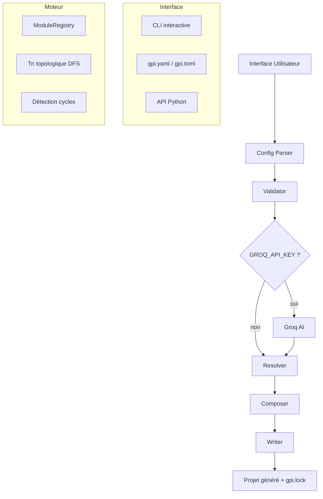
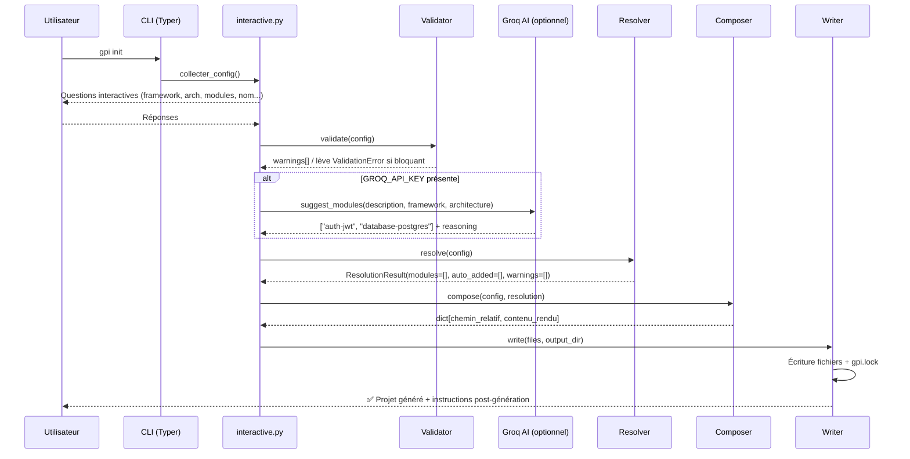
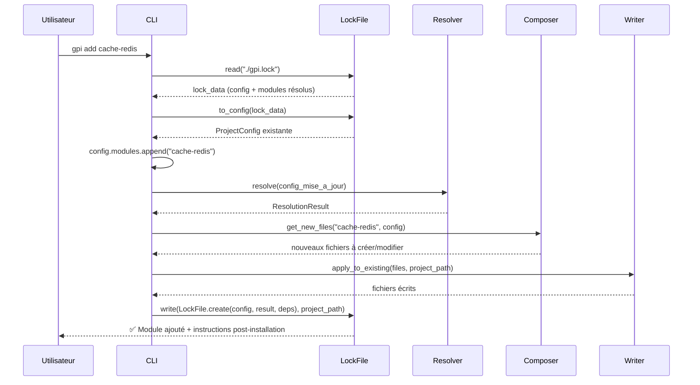
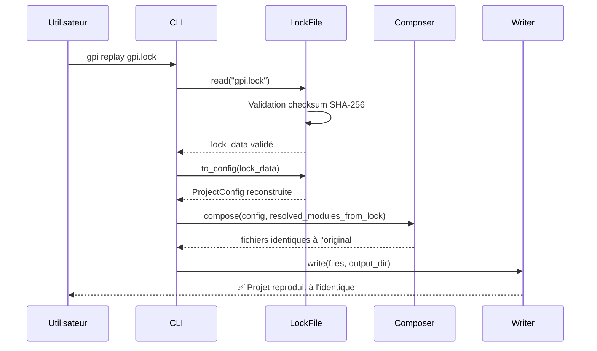
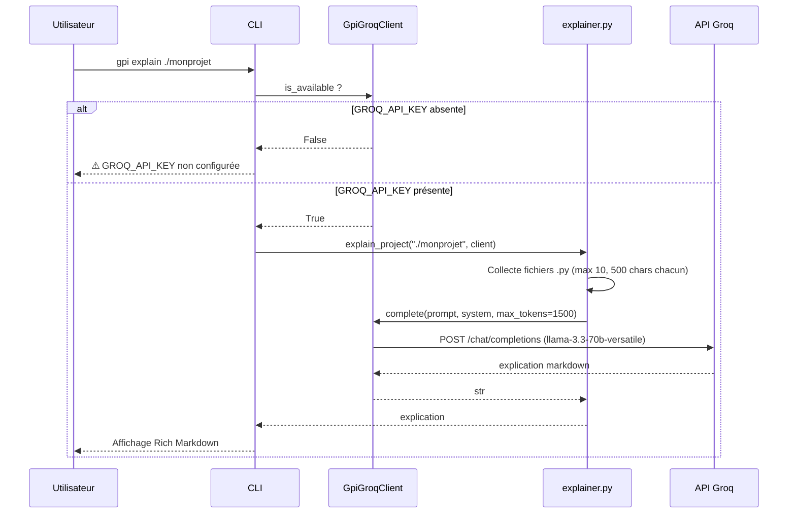

# Document de Conception : GPI v2 — Refactoring Majeur

## Vue d'ensemble

GPI (Générateur de Projet Intelligent) v2 est une refonte architecturale complète du package `py_gpi` v0.1.
L'objectif est de transformer un générateur de templates statiques en un **compositeur de projets modulaire**
capable de résoudre des dépendances entre modules, de garantir la reproductibilité via un fichier `gpi.lock`,
et d'intégrer une assistance IA via Groq.

La v2 corrige les incohérences de la v0.1 (niveaux arbitraires, option bilingue, microservices non bloqués)
et introduit une architecture en couches claire :
**Interface → Config → Validator → Groq AI (optionnel) → Resolver → Composer → Writer**.

La migration se fait en trois phases versionnées : v0.2.0 (corrections immédiates), v0.5.0 (fondations
modulaires), v1.0.0 (fonctionnalités avancées). Le package reste 100% fonctionnel hors-ligne.
L'IA Groq est optionnelle et se déclenche uniquement si `GROQ_API_KEY` est définie.
Python 3.9+ est requis, Pydantic v2 pour la validation, Typer + Rich pour la CLI, Jinja2 pour les templates.


## Architecture

### Vue d'ensemble des couches

```
┌─────────────────────────────────────────────────────┐
│                   INTERFACE UTILISATEUR              │
│  CLI interactive  │  gpi.yaml/toml  │  API Python   │
├─────────────────────────────────────────────────────┤
│                  MOTEUR DE RÉSOLUTION                │
│  Validation des modules  │  Résolution des deps      │
│  Détection des conflits  │  Validation des combos   │
├─────────────────────────────────────────────────────┤
│               REGISTRE DE MODULES                    │
│  auth-jwt  │  database-postgres  │  cache-redis      │
│  queue-celery  │  docker  │  tests-pytest  │  ...   │
├─────────────────────────────────────────────────────┤
│                   MOTEUR GROQ AI                     │
│  Suggestions  │  Complétion  │  Explication code    │
├─────────────────────────────────────────────────────┤
│                   COMPOSITEUR                        │
│  Assemblage  │  Injection deps  │  Rendu templates  │
├─────────────────────────────────────────────────────┤
│                    SORTIE                            │
│  Projet généré  │  gpi.lock  │  README.md généré   │
└─────────────────────────────────────────────────────┘
```

### Diagramme de flux de données




### Structure des fichiers du package v2

```
gpi/
├── __init__.py                  ← API publique : gpi.compose(), gpi.from_yaml(), GenerationPlan
├── __main__.py                  ← Permet `python -m gpi`
│
├── cli/
│   ├── __init__.py
│   ├── app.py                   ← Application Typer principale, enregistrement des commandes
│   ├── commands/
│   │   ├── __init__.py
│   │   ├── init.py              ← gpi init (assistant interactif ou -c fichier)
│   │   ├── add.py               ← gpi add <module> (ajout à projet existant)
│   │   ├── upgrade.py           ← gpi upgrade [module] [--dry-run]
│   │   ├── replay.py            ← gpi replay gpi.lock [--output dir] [--check]
│   │   ├── plugin.py            ← gpi plugin install/list/uninstall/publish
│   │   ├── explain.py           ← gpi explain [chemin] (nécessite GROQ_API_KEY)
│   │   └── version.py           ← gpi version
│   └── interactive.py           ← Questionnaire interactif Rich (sans niveaux)
│
├── core/
│   ├── __init__.py
│   ├── config.py                ← ProjectConfig (Pydantic v2)
│   ├── resolver.py              ← Resolver + ResolutionResult (tri topologique)
│   ├── validator.py             ← Validator + VALIDATION_RULES (déclaratif)
│   ├── composer.py              ← Composer (assemblage fichiers depuis modules)
│   ├── writer.py                ← Writer (écriture disque + gpi.lock)
│   ├── lock.py                  ← LockFile (create/write/read/to_config)
│   └── exceptions.py            ← Hiérarchie d'exceptions GpiError
│
├── modules/
│   ├── __init__.py
│   ├── base.py                  ← Module (ABC) + ModuleMetadata (dataclass)
│   ├── registry.py              ← ModuleRegistry (natifs + plugins entry_points)
│   ├── framework/
│   │   ├── fastapi.py           ← FastAPIModule
│   │   ├── flask.py             ← FlaskModule
│   │   └── django.py            ← DjangoModule
│   ├── auth/
│   │   ├── jwt.py               ← JWTAuthModule
│   │   ├── sessions.py          ← SessionsAuthModule
│   │   └── oauth2.py            ← OAuth2Module
│   ├── database/
│   │   ├── sqlite.py            ← SQLiteModule
│   │   ├── postgres.py          ← PostgresModule
│   │   └── mysql.py             ← MySQLModule
│   ├── cache/
│   │   └── redis.py             ← RedisModule
│   ├── queue/
│   │   ├── celery.py            ← CeleryModule
│   │   └── rq.py                ← RQModule
│   ├── infra/
│   │   ├── docker.py            ← DockerModule
│   │   ├── docker_compose.py    ← DockerComposeModule
│   │   └── github_actions.py    ← GitHubActionsModule
│   ├── testing/
│   │   └── pytest.py            ← PytestModule
│   └── monitoring/
│       └── prometheus_grafana.py ← PrometheusModule
│
├── templates/                   ← Templates Jinja2 (.j2)
│   ├── fastapi/
│   │   ├── monolithic/          ← main.py.j2, database.py.j2, crud/*.j2, ...
│   │   └── microservices/       ← docker-compose.yml.j2, services/*/...
│   ├── flask/
│   │   ├── monolithic/
│   │   └── microservices/
│   ├── django/
│   │   └── monolithic/
│   └── common/                  ← README.md.j2, .env.j2, .gitignore.j2, requirements.txt.j2
│
├── ai/
│   ├── __init__.py
│   ├── client.py                ← GpiGroqClient (auth, retry, erreurs)
│   ├── suggestions.py           ← suggest_modules() → list[str]
│   ├── completion.py            ← Complétion des champs manquants
│   └── explainer.py             ← explain_project() → str
│
└── utils/
    ├── __init__.py
    ├── network.py               ← detecter_ips() (conservé de v0.1)
    ├── filesystem.py            ← Opérations fichiers sécurisées
    └── display.py               ← Affichage Rich (panels, progress, tables)
```


## Diagrammes de séquence

### Flux principal : `gpi init`



### Flux : `gpi add <module>`



### Flux : `gpi replay gpi.lock`



### Flux : `gpi explain` (IA)




## Composants et interfaces

### `ProjectConfig` — Modèle de configuration (Pydantic v2)

**Fichier** : `gpi/core/config.py`

**Rôle** : Source de vérité unique pour la configuration d'un projet. Valide les entrées dès la construction.
Remplace l'ancien `ProjectConfig` de v0.1 qui contenait des champs obsolètes (`niveau`, `route_org`, `bilingue`).

```python
# gpi/core/config.py

from pydantic import BaseModel, field_validator, model_validator
from typing import Optional
import re


class ProjectConfig(BaseModel):
    """Configuration complète d'un projet GPI."""

    # Champs obligatoires
    framework: str                    # "fastapi" | "flask" | "django"
    name: str                         # Nom du projet (regex validé)

    # Champs avec valeurs par défaut
    architecture: str = "monolithic"  # "monolithic" | "microservices"
    modules: list[str] = []           # IDs des modules demandés
    description: str = ""
    language: str = "fr"              # "fr" | "en" (bilingue supprimé)
    port: int = 8000
    services: list[str] = []          # Noms des services (microservices uniquement)
    use_groq_ai: bool = False         # Active les suggestions IA

    @field_validator("framework")
    @classmethod
    def validate_framework(cls, v: str) -> str:
        allowed = ["fastapi", "flask", "django"]
        if v not in allowed:
            raise ValueError(f"framework doit être l'un de: {allowed}")
        return v

    @field_validator("architecture")
    @classmethod
    def validate_architecture(cls, v: str) -> str:
        allowed = ["monolithic", "microservices"]
        if v not in allowed:
            raise ValueError(f"architecture doit être l'une de: {allowed}")
        return v

    @field_validator("name")
    @classmethod
    def validate_name(cls, v: str) -> str:
        # Regex stricte : lettre initiale, lettres/chiffres/underscores, 2-49 chars
        if not re.match(r"^[a-zA-Z][a-zA-Z0-9_]{1,48}$", v):
            raise ValueError(
                "Le nom doit commencer par une lettre, "
                "contenir uniquement lettres/chiffres/underscores, "
                "et faire entre 2 et 49 caractères."
            )
        return v

    @field_validator("language")
    @classmethod
    def validate_language(cls, v: str) -> str:
        allowed = ["fr", "en"]
        if v not in allowed:
            raise ValueError(f"language doit être l'un de: {allowed}")
        return v

    @field_validator("port")
    @classmethod
    def validate_port(cls, v: int) -> int:
        if not (1024 <= v <= 65535):
            raise ValueError("port doit être entre 1024 et 65535")
        return v

    @model_validator(mode="after")
    def validate_microservices_services(self) -> "ProjectConfig":
        """Injecte des services par défaut si microservices sans services déclarés."""
        if self.architecture == "microservices" and not self.services:
            self.services = ["auth", "users", "products"]
        return self

    @classmethod
    def from_yaml(cls, path: str) -> "ProjectConfig":
        """Charge une configuration depuis un fichier gpi.yaml."""
        import yaml
        with open(path, "r", encoding="utf-8") as f:
            data = yaml.safe_load(f)
        return cls(**data)

    @classmethod
    def from_toml(cls, path: str) -> "ProjectConfig":
        """Charge une configuration depuis un fichier gpi.toml."""
        try:
            import tomllib          # Python 3.11+
        except ImportError:
            import tomli as tomllib  # Python 3.9/3.10
        with open(path, "rb") as f:
            data = tomllib.load(f)
        return cls(**data)
```

**Décision de design** : Pydantic v2 est choisi pour sa validation stricte avec messages d'erreur clairs,
la conversion automatique des types, et l'intégration native avec FastAPI. Les erreurs de configuration
sont interceptées avant que la génération commence.


### `Module` (ABC) et `ModuleMetadata` — Classe de base des modules

**Fichier** : `gpi/modules/base.py`

**Rôle** : Contrat que tout module (natif ou plugin) doit respecter. Définit les méthodes abstraites
et les hooks optionnels.

```python
# gpi/modules/base.py

from abc import ABC, abstractmethod
from dataclasses import dataclass, field
from typing import TYPE_CHECKING

if TYPE_CHECKING:
    from gpi.core.config import ProjectConfig


@dataclass
class ModuleMetadata:
    """Métadonnées déclaratives d'un module GPI."""
    id: str                           # Ex: "auth-jwt" — identifiant unique kebab-case
    name: str                         # Ex: "Authentification JWT" — nom lisible
    version: str                      # Ex: "1.0.0" — version sémantique
    description: str                  # Description courte pour gpi plugin list
    frameworks: list[str]             # Frameworks supportés : ["fastapi", "flask", "django"]
    architectures: list[str]          # Architectures supportées : ["monolithic", "microservices"]
    requires: list[str] = field(default_factory=list)   # Modules requis (dépendances)
    conflicts: list[str] = field(default_factory=list)  # Modules incompatibles
    optional: list[str] = field(default_factory=list)   # Modules optionnels suggérés
    tags: list[str] = field(default_factory=list)       # Tags pour la recherche


class Module(ABC):
    """
    Classe de base abstraite pour tous les modules GPI.
    Chaque module natif ou plugin doit hériter de cette classe.
    """

    @property
    @abstractmethod
    def metadata(self) -> ModuleMetadata:
        """Retourne les métadonnées du module (id, version, compatibilités...)."""
        ...

    @abstractmethod
    def get_dependencies(self) -> list[str]:
        """
        Retourne les packages Python à ajouter à requirements.txt.

        Returns:
            Liste de spécifications pip (ex: ["python-jose[cryptography]>=3.3.0"])
        """
        ...

    @abstractmethod
    def get_files(self, config: "ProjectConfig") -> dict[str, str]:
        """
        Retourne les fichiers à générer pour ce module.

        Args:
            config: Configuration complète du projet

        Returns:
            Dictionnaire {chemin_relatif: contenu_jinja2_ou_texte}
            Ex: {"auth/security.py": "...", "auth/routes.py": "..."}
        """
        ...

    def get_env_vars(self) -> dict[str, str]:
        """
        Variables d'environnement à ajouter au .env (avec valeurs réelles).
        Ex: {"SECRET_KEY": "generated-secret", "JWT_ALGORITHM": "HS256"}
        """
        return {}

    def get_env_example_vars(self) -> dict[str, str]:
        """
        Variables pour .env.example (valeurs fictives/vides pour documentation).
        Ex: {"SECRET_KEY": "changez-moi", "JWT_ALGORITHM": "HS256"}
        """
        return {}

    def post_generate_instructions(self) -> list[str]:
        """
        Instructions affichées à l'utilisateur après la génération.
        Ex: ["Initialisez la base : alembic upgrade head"]
        """
        return []
```


### `ModuleRegistry` — Registre central des modules

**Fichier** : `gpi/modules/registry.py`

**Rôle** : Charge et indexe tous les modules (natifs + plugins via `entry_points`). Point d'accès unique
pour le Resolver et le Composer.

```python
# gpi/modules/registry.py

import importlib.metadata
from gpi.modules.base import Module


class ModuleRegistry:
    """
    Registre central de tous les modules GPI.
    Charge les modules natifs au démarrage, puis les plugins via entry_points.
    """

    ENTRY_POINT_GROUP = "gpi.modules"  # Groupe entry_point pour les plugins tiers

    def __init__(self):
        self._modules: dict[str, Module] = {}
        self._load_builtin_modules()
        self._load_plugin_modules()

    def _load_builtin_modules(self) -> None:
        """Charge les modules natifs embarqués dans le package GPI."""
        from gpi.modules.framework.fastapi import FastAPIModule
        from gpi.modules.framework.flask import FlaskModule
        from gpi.modules.framework.django import DjangoModule
        from gpi.modules.auth.jwt import JWTAuthModule
        from gpi.modules.auth.sessions import SessionsAuthModule
        from gpi.modules.auth.oauth2 import OAuth2Module
        from gpi.modules.database.sqlite import SQLiteModule
        from gpi.modules.database.postgres import PostgresModule
        from gpi.modules.database.mysql import MySQLModule
        from gpi.modules.cache.redis import RedisModule
        from gpi.modules.queue.celery import CeleryModule
        from gpi.modules.queue.rq import RQModule
        from gpi.modules.infra.docker import DockerModule
        from gpi.modules.infra.docker_compose import DockerComposeModule
        from gpi.modules.infra.github_actions import GitHubActionsModule
        from gpi.modules.testing.pytest import PytestModule
        from gpi.modules.monitoring.prometheus_grafana import PrometheusModule

        for module_class in [
            FastAPIModule, FlaskModule, DjangoModule,
            JWTAuthModule, SessionsAuthModule, OAuth2Module,
            SQLiteModule, PostgresModule, MySQLModule,
            RedisModule, CeleryModule, RQModule,
            DockerModule, DockerComposeModule, GitHubActionsModule,
            PytestModule, PrometheusModule,
        ]:
            instance = module_class()
            self._modules[instance.metadata.id] = instance

    def _load_plugin_modules(self) -> None:
        """
        Charge les plugins installés via entry_points Python.
        Un plugin déclare : [project.entry-points."gpi.modules"] stripe = "gpi_stripe:StripeModule"
        Les erreurs de chargement sont silencieuses (plugin mal installé ne bloque pas GPI).
        """
        try:
            eps = importlib.metadata.entry_points(group=self.ENTRY_POINT_GROUP)
            for ep in eps:
                try:
                    module_class = ep.load()
                    instance = module_class()
                    self._modules[instance.metadata.id] = instance
                except Exception as e:
                    # Avertissement non bloquant : plugin défectueux ignoré
                    print(f"⚠ Plugin '{ep.name}' ignoré : {e}")
        except Exception:
            pass  # Aucun plugin installé

    def get(self, module_id: str) -> Module | None:
        """Retourne un module par son ID, ou None s'il n'existe pas."""
        return self._modules.get(module_id)

    def list_all(self) -> list[Module]:
        """Retourne tous les modules disponibles (natifs + plugins)."""
        return list(self._modules.values())

    def search(self, query: str) -> list[Module]:
        """
        Recherche dans les IDs, noms, descriptions et tags.

        Args:
            query: Terme de recherche (insensible à la casse)

        Returns:
            Liste des modules correspondants
        """
        q = query.lower()
        return [
            m for m in self._modules.values()
            if (
                q in m.metadata.id.lower()
                or q in m.metadata.name.lower()
                or q in m.metadata.description.lower()
                or any(q in tag for tag in m.metadata.tags)
            )
        ]
```


### `Resolver` — Résolution des dépendances (tri topologique)

**Fichier** : `gpi/core/resolver.py`

**Rôle** : Résoud les dépendances entre modules via un DFS (Depth-First Search) avec détection de cycles.
Garantit un ordre de résolution cohérent (le framework est toujours résolu en premier).

```python
# gpi/core/resolver.py

from dataclasses import dataclass
from typing import Optional
from gpi.modules.registry import ModuleRegistry
from gpi.core.config import ProjectConfig
from gpi.core.exceptions import (
    ModuleNotFoundError,
    ModuleConflictError,
    ModuleIncompatibleError,
    CircularDependencyError,
)


@dataclass
class ResolutionResult:
    """Résultat de la résolution des dépendances."""
    modules: list[str]       # Ordre de résolution final (tri topologique)
    auto_added: list[str]    # Modules ajoutés automatiquement (non demandés)
    warnings: list[str]      # Avertissements non bloquants


class Resolver:
    """
    Résoud les dépendances entre modules GPI.

    Algorithme : DFS (Depth-First Search) avec détection de cycles.
    Complexité : O(V + E) où V = modules, E = dépendances.

    Étapes de résolution :
    1. Validation existence de chaque module dans le registre
    2. Validation compatibilité framework/architecture
    3. Résolution récursive des dépendances (DFS)
    4. Détection de conflits (modules incompatibles)
    5. Détection de cycles (dépendances circulaires)
    6. Tri topologique final (framework en premier)
    """

    def __init__(self, registry: ModuleRegistry):
        self.registry = registry

    def resolve(self, config: ProjectConfig) -> ResolutionResult:
        """
        Résoud la liste de modules demandés + leurs dépendances transitives.

        Args:
            config: Configuration du projet avec la liste des modules demandés

        Returns:
            ResolutionResult avec l'ordre de résolution, les modules auto-ajoutés
            et les avertissements

        Raises:
            ModuleNotFoundError: Module introuvable dans le registre
            ModuleIncompatibleError: Module incompatible avec le framework/architecture
            ModuleConflictError: Deux modules incompatibles demandés simultanément
            CircularDependencyError: Dépendance circulaire détectée
        """
        requested = set(config.modules)
        resolved: list[str] = []
        auto_added: list[str] = []
        warnings: list[str] = []
        visiting: set[str] = set()   # Nœuds en cours de visite (détection cycles)
        visited: set[str] = set()    # Nœuds déjà résolus

        def visit(module_id: str, required_by: Optional[str] = None) -> None:
            if module_id in visited:
                return  # Déjà résolu, on ignore
            if module_id in visiting:
                raise CircularDependencyError(
                    f"Dépendance circulaire détectée impliquant '{module_id}'"
                )

            module = self.registry.get(module_id)
            if module is None:
                raise ModuleNotFoundError(
                    f"Module '{module_id}' introuvable dans le registre. "
                    f"Utilisez `gpi plugin list` pour voir les modules disponibles."
                )

            # Vérification compatibilité framework
            if config.framework not in module.metadata.frameworks:
                raise ModuleIncompatibleError(
                    f"Le module '{module_id}' ne supporte pas le framework "
                    f"'{config.framework}'. Frameworks supportés : "
                    f"{module.metadata.frameworks}"
                )

            # Vérification compatibilité architecture
            if config.architecture not in module.metadata.architectures:
                raise ModuleIncompatibleError(
                    f"Le module '{module_id}' ne supporte pas l'architecture "
                    f"'{config.architecture}'"
                )

            # Vérification conflits avec les modules déjà résolus
            for conflict in module.metadata.conflicts:
                if conflict in requested or conflict in auto_added:
                    raise ModuleConflictError(
                        f"'{module_id}' est incompatible avec '{conflict}'. "
                        f"Choisissez l'un ou l'autre."
                    )

            visiting.add(module_id)

            # Résolution récursive des dépendances (DFS)
            for dep in module.metadata.requires:
                if dep not in requested and dep not in auto_added:
                    auto_added.append(dep)
                    warnings.append(
                        f"Module '{dep}' ajouté automatiquement "
                        f"(requis par '{module_id}')"
                    )
                visit(dep, required_by=module_id)

            visiting.remove(module_id)
            visited.add(module_id)
            resolved.append(module_id)

        # Le framework est toujours résolu en premier (nœud racine)
        visit(f"framework-{config.framework}")

        # Résolution de chaque module demandé
        for module_id in config.modules:
            visit(module_id)

        return ResolutionResult(
            modules=resolved,
            auto_added=auto_added,
            warnings=warnings,
        )
```


### `Validator` — Règles métier déclaratives

**Fichier** : `gpi/core/validator.py`

**Rôle** : Valide les combinaisons de modules avant la résolution. Les règles sont exprimées de façon
déclarative (liste de dicts) pour faciliter l'ajout de nouvelles règles sans modifier la logique.

```python
# gpi/core/validator.py

from gpi.core.config import ProjectConfig
from gpi.core.exceptions import ValidationError

# Règles déclaratives : condition (lambda) + message + blocking (bool)
# blocking=True  → lève ValidationError (arrêt immédiat)
# blocking=False → avertissement affiché, génération continue
VALIDATION_RULES: list[dict] = [
    {
        "condition": lambda c: (
            c.architecture == "microservices" and len(c.modules) < 2
        ),
        "message": (
            "L'architecture microservices nécessite au moins 2 modules. "
            "Ajoutez des modules (ex: auth-jwt, database-postgres) ou "
            "utilisez l'architecture monolithique."
        ),
        "blocking": True,
    },
    {
        "condition": lambda c: (
            "auth-oauth2" in c.modules and "auth-jwt" in c.modules
        ),
        "message": (
            "Choisissez un seul mécanisme d'authentification : "
            "auth-jwt OU auth-oauth2."
        ),
        "blocking": True,
    },
    {
        "condition": lambda c: (
            "queue-celery" in c.modules and "cache-redis" not in c.modules
        ),
        "message": (
            "Celery nécessite un broker. Le module cache-redis sera ajouté "
            "automatiquement comme broker Celery."
        ),
        "blocking": False,
    },
    {
        "condition": lambda c: (
            c.framework == "django" and "auth-jwt" in c.modules
        ),
        "message": (
            "Django dispose d'un système d'auth intégré. "
            "auth-jwt utilisera djangorestframework-simplejwt."
        ),
        "blocking": False,
    },
    {
        "condition": lambda c: (
            c.architecture == "microservices" and c.framework == "django"
        ),
        "message": (
            "Django en microservices est une architecture avancée. "
            "FastAPI est recommandé pour les microservices Python."
        ),
        "blocking": False,
    },
    {
        "condition": lambda c: (
            "auth-sessions" in c.modules and c.framework == "fastapi"
        ),
        "message": (
            "auth-sessions est conçu pour Flask/Django. "
            "Pour FastAPI, préférez auth-jwt ou auth-oauth2."
        ),
        "blocking": False,
    },
    {
        "condition": lambda c: (
            "monitoring-prometheus" in c.modules and c.framework == "django"
        ),
        "message": (
            "Le module monitoring-prometheus ne supporte pas Django. "
            "Utilisez FastAPI ou Flask pour le monitoring Prometheus."
        ),
        "blocking": True,
    },
]


class Validator:
    """
    Valide la configuration avant la résolution des modules.
    Applique les règles déclaratives de VALIDATION_RULES.
    """

    def validate(self, config: ProjectConfig) -> list[str]:
        """
        Valide la configuration.

        Args:
            config: Configuration à valider

        Returns:
            Liste des avertissements non bloquants

        Raises:
            ValidationError: Si une règle bloquante est violée
        """
        warnings: list[str] = []

        for rule in VALIDATION_RULES:
            if rule["condition"](config):
                if rule["blocking"]:
                    raise ValidationError(rule["message"])
                else:
                    warnings.append(rule["message"])

        return warnings
```


### `Composer` — Assemblage des fichiers

**Fichier** : `gpi/core/composer.py`

**Rôle** : Agrège les fichiers de tous les modules résolus, rend les templates Jinja2, et produit
un dictionnaire `{chemin_relatif: contenu_final}` prêt à être écrit sur disque.

```python
# gpi/core/composer.py

from jinja2 import Environment, BaseLoader
from gpi.core.config import ProjectConfig
from gpi.core.resolver import ResolutionResult
from gpi.modules.registry import ModuleRegistry


class Composer:
    """
    Assemble les fichiers de tous les modules résolus.
    Rend les templates Jinja2 avec le contexte du projet.
    Gère les conflits de fichiers (dernier module gagne, avec avertissement).
    """

    def __init__(self, registry: ModuleRegistry):
        self.registry = registry
        # Environnement Jinja2 pour le rendu des templates inline
        self._jinja_env = Environment(loader=BaseLoader(), autoescape=False)

    def compose(
        self,
        config: ProjectConfig,
        resolution: ResolutionResult,
    ) -> dict[str, str]:
        """
        Assemble tous les fichiers du projet.

        Args:
            config: Configuration du projet
            resolution: Résultat de la résolution des modules

        Returns:
            Dictionnaire {chemin_relatif: contenu_rendu}
        """
        files: dict[str, str] = {}
        context = self._build_context(config, resolution)

        for module_id in resolution.modules:
            module = self.registry.get(module_id)
            if module is None:
                continue

            module_files = module.get_files(config)
            for path, content in module_files.items():
                # Rendu Jinja2 du contenu
                rendered = self._render(content, context)
                files[path] = rendered

        return files

    def get_new_files(
        self,
        module_id: str,
        config: ProjectConfig,
    ) -> dict[str, str]:
        """
        Retourne uniquement les fichiers d'un module spécifique.
        Utilisé par `gpi add` pour ajouter un module à un projet existant.
        """
        module = self.registry.get(module_id)
        if module is None:
            return {}
        context = self._build_context(config, ResolutionResult([], [], []))
        return {
            path: self._render(content, context)
            for path, content in module.get_files(config).items()
        }

    def get_all_dependencies(self, resolution: ResolutionResult) -> list[str]:
        """
        Collecte tous les packages Python de tous les modules résolus.
        Utilisé pour générer requirements.txt et gpi.lock.
        """
        deps: list[str] = []
        for module_id in resolution.modules:
            module = self.registry.get(module_id)
            if module:
                deps.extend(module.get_dependencies())
        return sorted(set(deps))

    def apply_to_existing(
        self,
        new_files: dict[str, str],
        project_path: str,
    ) -> None:
        """
        Applique de nouveaux fichiers à un projet existant.
        Ne modifie pas les fichiers existants (sauf si le module le demande explicitement).
        """
        from pathlib import Path
        for rel_path, content in new_files.items():
            full_path = Path(project_path) / rel_path
            full_path.parent.mkdir(parents=True, exist_ok=True)
            full_path.write_text(content, encoding="utf-8")

    def _build_context(
        self,
        config: ProjectConfig,
        resolution: ResolutionResult,
    ) -> dict:
        """Construit le contexte Jinja2 à partir de la configuration."""
        return {
            "project_name": config.name,
            "description": config.description or config.name,
            "framework": config.framework,
            "architecture": config.architecture,
            "language": config.language,
            "port": config.port,
            "modules": resolution.modules,
            "services": config.services,
            "is_microservices": config.architecture == "microservices",
        }

    def _render(self, template_str: str, context: dict) -> str:
        """Rend un template Jinja2 avec le contexte donné."""
        try:
            template = self._jinja_env.from_string(template_str)
            return template.render(**context)
        except Exception:
            return template_str  # Retourne le contenu brut si le rendu échoue
```


### `Writer` — Écriture sur disque

**Fichier** : `gpi/core/writer.py`

**Rôle** : Écrit les fichiers composés sur le disque de façon sécurisée (création des dossiers parents,
gestion des permissions). Génère également le `gpi.lock`.

```python
# gpi/core/writer.py

from pathlib import Path
from gpi.core.config import ProjectConfig
from gpi.core.resolver import ResolutionResult
from gpi.core.lock import LockFile
from gpi.modules.registry import ModuleRegistry


class Writer:
    """
    Écrit les fichiers composés sur le disque.
    Crée les dossiers parents si nécessaire.
    Génère le gpi.lock après l'écriture.
    """

    def write(
        self,
        files: dict[str, str],
        output_dir: str,
        config: ProjectConfig | None = None,
        resolution: ResolutionResult | None = None,
        registry: ModuleRegistry | None = None,
    ) -> Path:
        """
        Écrit tous les fichiers dans output_dir.

        Args:
            files: Dictionnaire {chemin_relatif: contenu}
            output_dir: Dossier de sortie (créé si inexistant)
            config: Configuration du projet (pour gpi.lock)
            resolution: Résultat de résolution (pour gpi.lock)
            registry: Registre des modules (pour collecter les dépendances)

        Returns:
            Chemin absolu du dossier de sortie
        """
        out = Path(output_dir)
        out.mkdir(parents=True, exist_ok=True)

        for rel_path, content in files.items():
            full_path = out / rel_path
            full_path.parent.mkdir(parents=True, exist_ok=True)
            full_path.write_text(content, encoding="utf-8")

        # Génération du gpi.lock si les informations sont disponibles
        if config and resolution and registry:
            from gpi.core.composer import Composer
            composer = Composer(registry)
            deps = composer.get_all_dependencies(resolution)
            lock_data = LockFile.create(config, resolution, deps)
            LockFile.write(lock_data, output_dir)

        return out.resolve()
```

### `LockFile` — Reproductibilité des projets

**Fichier** : `gpi/core/lock.py`

**Rôle** : Crée, écrit et lit le fichier `gpi.lock`. Garantit l'intégrité via un checksum SHA-256.
Permet de reproduire exactement un projet généré via `gpi replay`.

```python
# gpi/core/lock.py

import json
import hashlib
from datetime import datetime, timezone
from pathlib import Path
from gpi.core.config import ProjectConfig
from gpi.core.resolver import ResolutionResult
import gpi


class LockFile:
    """
    Gestion du fichier gpi.lock.

    Format JSON lisible par un humain, versionnable dans Git.
    Contient : version GPI, config, modules résolus, dépendances Python, checksum.
    """

    FILENAME = "gpi.lock"

    @staticmethod
    def create(
        config: ProjectConfig,
        resolution: ResolutionResult,
        dependencies: list[str],
    ) -> dict:
        """
        Crée le contenu du fichier gpi.lock.

        Args:
            config: Configuration du projet
            resolution: Résultat de la résolution
            dependencies: Liste des packages Python (requirements.txt)

        Returns:
            Dictionnaire prêt à sérialiser en JSON
        """
        data = {
            "gpi_version": gpi.__version__,
            "generated_at": datetime.now(timezone.utc).isoformat(),
            "config": config.model_dump(),
            "resolved_modules": [
                {
                    "id": module_id,
                    "version": "1.0.0",
                    "auto": module_id in resolution.auto_added,
                }
                for module_id in resolution.modules
            ],
            "python_dependencies": sorted(dependencies),
        }
        # Checksum pour détecter les modifications manuelles
        content = json.dumps(data, sort_keys=True, ensure_ascii=False)
        data["checksum"] = f"sha256:{hashlib.sha256(content.encode()).hexdigest()}"
        return data

    @staticmethod
    def write(data: dict, output_dir: str) -> Path:
        """Écrit le fichier gpi.lock dans le dossier de sortie."""
        lock_path = Path(output_dir) / LockFile.FILENAME
        with open(lock_path, "w", encoding="utf-8") as f:
            json.dump(data, f, indent=2, ensure_ascii=False)
        return lock_path

    @staticmethod
    def read(path: str) -> dict:
        """
        Lit et valide un fichier gpi.lock.

        Raises:
            ValueError: Si le checksum est invalide (fichier corrompu ou modifié)
        """
        with open(path, "r", encoding="utf-8") as f:
            data = json.load(f)

        # Validation du checksum
        checksum = data.pop("checksum", None)
        if checksum:
            content = json.dumps(data, sort_keys=True, ensure_ascii=False)
            expected = f"sha256:{hashlib.sha256(content.encode()).hexdigest()}"
            if checksum != expected:
                raise ValueError(
                    "Le fichier gpi.lock est corrompu ou a été modifié manuellement. "
                    "Régénérez-le avec `gpi init` ou `gpi replay gpi.yaml`."
                )
            data["checksum"] = checksum

        return data

    @staticmethod
    def to_config(lock_data: dict) -> ProjectConfig:
        """Reconstruit une ProjectConfig depuis les données d'un gpi.lock."""
        return ProjectConfig(**lock_data["config"])
```


### `GpiGroqClient` — Intégration Groq AI

**Fichier** : `gpi/ai/client.py`

**Rôle** : Client Groq avec gestion d'authentification, d'erreurs et de retry. Entièrement optionnel —
GPI fonctionne sans clé API.

```python
# gpi/ai/client.py

import os
from typing import Optional
from groq import Groq, APIConnectionError, RateLimitError, APIStatusError


class GpiGroqClient:
    """
    Client Groq pour GPI.
    Instancié une seule fois (lazy) pour éviter les connexions inutiles.
    """

    MODEL = "llama-3.3-70b-versatile"   # Équilibre vitesse/qualité
    FAST_MODEL = "llama-3.1-8b-instant" # Pour les requêtes rapides (suggestions)

    def __init__(self, api_key: Optional[str] = None):
        # Priorité : paramètre > variable d'environnement
        self.api_key = api_key or os.environ.get("GROQ_API_KEY")
        self._client: Optional[Groq] = None  # Lazy initialization

    @property
    def is_available(self) -> bool:
        """True si GROQ_API_KEY est configurée."""
        return bool(self.api_key)

    def _get_client(self) -> Groq:
        """Retourne le client Groq (lazy init)."""
        if not self.is_available:
            raise RuntimeError(
                "GROQ_API_KEY non configurée. "
                "Ajoutez 'GROQ_API_KEY=votre-cle' à votre fichier .env."
            )
        if self._client is None:
            self._client = Groq(api_key=self.api_key)
        return self._client

    def complete(
        self,
        prompt: str,
        system: str = "Tu es un expert en développement backend Python.",
        model: Optional[str] = None,
        max_tokens: int = 1024,
        temperature: float = 0.3,
    ) -> str:
        """
        Envoie un prompt au modèle Groq et retourne la réponse textuelle.

        Args:
            prompt: Message utilisateur
            system: Message système (contexte du modèle)
            model: Modèle à utiliser (défaut: MODEL)
            max_tokens: Nombre maximum de tokens en sortie
            temperature: Créativité (0 = déterministe, 1 = créatif)

        Returns:
            Réponse textuelle du modèle

        Raises:
            RuntimeError: GROQ_API_KEY non configurée
            Exception: Erreur réseau ou API Groq
        """
        client = self._get_client()
        try:
            response = client.chat.completions.create(
                messages=[
                    {"role": "system", "content": system},
                    {"role": "user", "content": prompt},
                ],
                model=model or self.MODEL,
                max_tokens=max_tokens,
                temperature=temperature,
            )
            return response.choices[0].message.content
        except APIConnectionError:
            raise Exception(
                "Impossible de contacter l'API Groq. Vérifiez votre connexion internet."
            )
        except RateLimitError:
            raise Exception(
                "Limite de taux Groq atteinte. Réessayez dans quelques secondes."
            )
        except APIStatusError as e:
            raise Exception(f"Erreur Groq API (status {e.status_code}): {e.message}")
```

### `suggest_modules()` — Suggestions IA de modules

**Fichier** : `gpi/ai/suggestions.py`

```python
# gpi/ai/suggestions.py

import json
from gpi.ai.client import GpiGroqClient

SYSTEM_PROMPT = """Tu es un expert en architecture backend Python.
Tu dois suggérer des modules GPI pertinents pour un projet donné.
Tu ne réponds qu'en JSON valide, sans explication supplémentaire.
Les modules disponibles sont :
- auth-jwt, auth-sessions, auth-oauth2
- database-sqlite, database-postgres, database-mysql
- cache-redis, queue-celery, queue-rq
- docker, docker-compose, tests-pytest
- monitoring-prometheus, github-actions
"""


def suggest_modules(
    description: str,
    framework: str,
    architecture: str,
    client: GpiGroqClient,
) -> list[str]:
    """
    Suggère des modules GPI basé sur la description du projet.

    Args:
        description: Description libre du projet par l'utilisateur
        framework: Framework choisi
        architecture: Architecture choisie
        client: Client Groq initialisé

    Returns:
        Liste d'IDs de modules suggérés (vide si échec silencieux)
    """
    prompt = f"""
Analyse ce projet et suggère les modules GPI appropriés :

Description : {description}
Framework   : {framework}
Architecture: {architecture}

Réponds avec un JSON de ce format exact :
{{"modules": ["auth-jwt", "database-postgres"], "reasoning": "Courte explication"}}

Ne suggère que les modules vraiment nécessaires. Évite la sur-ingénierie.
"""
    try:
        response = client.complete(
            prompt=prompt,
            system=SYSTEM_PROMPT,
            model=GpiGroqClient.FAST_MODEL,
            max_tokens=256,
            temperature=0.1,
        )
        data = json.loads(response.strip())
        return data.get("modules", [])
    except (json.JSONDecodeError, KeyError, Exception):
        return []  # Échec silencieux — GPI continue sans suggestion
```


### Hiérarchie des exceptions

**Fichier** : `gpi/core/exceptions.py`

```python
# gpi/core/exceptions.py


class GpiError(Exception):
    """Classe de base pour toutes les erreurs GPI."""
    pass


class ValidationError(GpiError):
    """Configuration invalide (règle métier violée)."""
    pass


class ModuleNotFoundError(GpiError):
    """Module demandé introuvable dans le registre."""
    pass


class ModuleConflictError(GpiError):
    """Deux modules incompatibles ont été demandés simultanément."""
    pass


class ModuleIncompatibleError(GpiError):
    """Module incompatible avec le framework ou l'architecture choisis."""
    pass


class CircularDependencyError(GpiError):
    """Dépendance circulaire détectée entre modules."""
    pass


class LockFileError(GpiError):
    """Erreur liée au fichier gpi.lock (corrompu, manquant, version incompatible)."""
    pass


class GroqAIError(GpiError):
    """Erreur lors de l'appel à l'API Groq."""
    pass
```


## Modèles de données

### Format du fichier `gpi.lock`

```json
{
  "gpi_version": "2.0.0",
  "generated_at": "2025-01-15T10:30:00Z",
  "config": {
    "name": "mon_catalogue",
    "framework": "fastapi",
    "architecture": "monolithic",
    "modules": ["auth-jwt", "database-postgres", "tests-pytest"],
    "description": "API de gestion de catalogue produits",
    "language": "fr",
    "port": 8000,
    "services": [],
    "use_groq_ai": false
  },
  "resolved_modules": [
    {"id": "framework-fastapi", "version": "1.0.0", "auto": false},
    {"id": "auth-jwt",          "version": "1.2.0", "auto": false},
    {"id": "database-postgres", "version": "1.1.0", "auto": false},
    {"id": "tests-pytest",      "version": "1.0.0", "auto": false},
    {"id": "docker",            "version": "1.0.0", "auto": true}
  ],
  "python_dependencies": [
    "fastapi==0.109.0",
    "uvicorn[standard]==0.27.0",
    "sqlalchemy==2.0.25",
    "psycopg2-binary==2.9.9",
    "python-jose[cryptography]==3.3.0",
    "passlib[bcrypt]==1.7.4",
    "alembic==1.13.1",
    "pytest==7.4.4",
    "httpx==0.26.0"
  ],
  "checksum": "sha256:abc123def456..."
}
```

### Format `gpi.yaml` (configuration déclarative)

```yaml
# gpi.yaml — Configuration déclarative GPI v2

# Informations du projet
name: mon_catalogue
description: "API de gestion de catalogue produits"
language: fr                         # "fr" | "en"

# Architecture
framework: fastapi                   # "fastapi" | "flask" | "django"
architecture: monolithic             # "monolithic" | "microservices"
port: 8000

# Modules à inclure (GPI résout les dépendances automatiquement)
modules:
  - auth-jwt
  - database-postgres
  - cache-redis
  - docker
  - tests-pytest

# Configuration microservices (si architecture: microservices)
services:
  - auth
  - catalogue
  - users

# Intégration IA
use_groq_ai: false
```

### Schémas Pydantic du domaine généré (exemple catalogue)

```python
# app/schemas/catalogue.py — Généré dans le projet cible

from pydantic import BaseModel, Field, ConfigDict
from typing import Optional, Generic, TypeVar
from datetime import datetime

T = TypeVar("T")


class CatalogueItemBase(BaseModel):
    """Champs communs à la création et à la mise à jour."""
    name: str = Field(..., min_length=1, max_length=100)
    description: Optional[str] = Field(None, max_length=500)
    price: float = Field(..., gt=0)
    stock: int = Field(0, ge=0)


class CatalogueItemCreate(CatalogueItemBase):
    """Schéma pour POST /catalogue/ — tous les champs requis."""
    pass


class CatalogueItemUpdate(CatalogueItemBase):
    """Schéma pour PUT /catalogue/{id} — remplacement complet."""
    pass


class CatalogueItemPartialUpdate(BaseModel):
    """Schéma pour PATCH /catalogue/{id} — tous les champs optionnels."""
    name: Optional[str] = Field(None, min_length=1, max_length=100)
    description: Optional[str] = None
    price: Optional[float] = Field(None, gt=0)
    stock: Optional[int] = Field(None, ge=0)


class CatalogueItemResponse(CatalogueItemBase):
    """Schéma de réponse — inclut les champs générés par la DB."""
    model_config = ConfigDict(from_attributes=True)  # Pydantic v2

    id: int
    created_at: datetime
    updated_at: datetime


class PaginatedResponse(BaseModel, Generic[T]):
    """Réponse paginée générique (utilisée par GET /catalogue/)."""
    total: int
    skip: int
    limit: int
    items: list[T]
```


## Système CRUD académique

### Philosophie : CRUD atomisé par fichier

L'idée fondamentale est d'**enseigner le CRUD comme des opérations séparées et indépendantes**,
chacune dans son propre fichier. Décision pédagogique forte validée par la pratique :

- Un étudiant ouvre `create.py` et voit uniquement la logique de création. Pas de bruit.
- Un professeur peut demander "implémentez la suppression" — l'étudiant sait exactement où aller.
- Les tests unitaires mappent parfaitement : `test_create.py` teste `create.py`.
- Correspond au pattern **CQRS** (Command Query Responsibility Segregation).
- En microservices réels, certaines opérations peuvent être scalées indépendamment.

### Structure CRUD générée (monolithique)

```
mon_catalogue/
├── main.py                          ← Point d'entrée FastAPI
├── database.py                      ← Connexion SQLAlchemy
├── app/
│   └── catalogue/                   ← Domaine "catalogue"
│       ├── __init__.py
│       ├── create.py                ← POST   /catalogue/
│       ├── read.py                  ← GET    /catalogue/ et /catalogue/{id}
│       ├── update.py                ← PUT    /catalogue/{id} et PATCH
│       └── delete.py                ← DELETE /catalogue/{id}
├── models/
│   └── catalogue.py                 ← Modèle SQLAlchemy CatalogueItem
├── schemas/
│   └── catalogue.py                 ← Schémas Pydantic (Create/Update/Response)
├── .env
├── .env.example
├── requirements.txt
├── README.md
└── gpi.lock
```

### Structure CRUD générée (microservices)

```
mon_catalogue/
├── docker-compose.yml
└── services/
    ├── catalogue/
    │   ├── main.py
    │   ├── database.py
    │   ├── models.py
    │   ├── schemas.py
    │   ├── crud/
    │   │   ├── __init__.py
    │   │   ├── create.py
    │   │   ├── read.py
    │   │   ├── update.py
    │   │   └── delete.py
    │   ├── Dockerfile
    │   ├── requirements.txt
    │   └── tests/
    │       ├── test_create.py
    │       ├── test_read.py
    │       ├── test_update.py
    │       └── test_delete.py
    ├── auth/
    │   └── crud/
    │       ├── create.py            ← Inscription
    │       ├── read.py              ← Récupérer profil
    │       ├── update.py            ← Modifier profil
    │       └── delete.py            ← Supprimer compte
    └── users/
        └── ...
```

### Assemblage des routers dans `main.py` (généré)

```python
# main.py — Généré dans le projet cible

from fastapi import FastAPI
from app.catalogue.create import router as catalogue_create_router
from app.catalogue.read   import router as catalogue_read_router
from app.catalogue.update import router as catalogue_update_router
from app.catalogue.delete import router as catalogue_delete_router

app = FastAPI(title="{{ project_name }}", version="1.0.0")

# Chaque opération CRUD est montée séparément
# Permet de désactiver/activer chaque opération indépendamment
app.include_router(catalogue_create_router, prefix="/catalogue", tags=["Catalogue — Create"])
app.include_router(catalogue_read_router,   prefix="/catalogue", tags=["Catalogue — Read"])
app.include_router(catalogue_update_router, prefix="/catalogue", tags=["Catalogue — Update"])
app.include_router(catalogue_delete_router, prefix="/catalogue", tags=["Catalogue — Delete"])
```


## Système de plugins

### Architecture

Un plugin GPI est un package Python qui expose une classe héritant de `Module`.
Il est déclaré via un `entry_point` dans son `pyproject.toml`.

```toml
# pyproject.toml d'un plugin tiers (ex: gpi-stripe)
[project.entry-points."gpi.modules"]
stripe = "gpi_stripe.module:StripeModule"
```

Le `ModuleRegistry` charge automatiquement tous les plugins installés au démarrage.
Les erreurs de chargement sont silencieuses (un plugin défectueux ne bloque pas GPI).

### Commandes de gestion des plugins

```bash
gpi plugin install gpi-stripe      # Installe depuis PyPI
gpi plugin list                    # Liste les plugins installés
gpi plugin uninstall gpi-stripe    # Désinstalle
gpi plugin publish ./mon-plugin    # Guide interactif de publication
```

### Exemple de plugin minimal

```python
# gpi_stripe/module.py

from gpi.modules.base import Module, ModuleMetadata
from gpi.core.config import ProjectConfig


class StripeModule(Module):
    """Module GPI pour l'intégration Stripe."""

    @property
    def metadata(self) -> ModuleMetadata:
        return ModuleMetadata(
            id="stripe",
            name="Stripe Payments",
            version="1.0.0",
            description="Intégration Stripe pour les paiements en ligne",
            frameworks=["fastapi", "flask"],
            architectures=["monolithic", "microservices"],
            requires=["database-postgres"],  # Stripe nécessite une DB
            tags=["payment", "stripe", "billing"],
        )

    def get_dependencies(self) -> list[str]:
        return ["stripe>=7.0.0"]

    def get_files(self, config: ProjectConfig) -> dict[str, str]:
        return {
            "payments/stripe_client.py": STRIPE_CLIENT_TEMPLATE,
            "payments/routes.py": STRIPE_ROUTES_TEMPLATE,
        }

    def get_env_vars(self) -> dict[str, str]:
        return {"STRIPE_SECRET_KEY": "sk_test_..."}

    def post_generate_instructions(self) -> list[str]:
        return [
            "Configurez STRIPE_SECRET_KEY dans votre .env",
            "Activez les webhooks Stripe sur https://dashboard.stripe.com",
        ]
```


## API Python publique

**Fichier** : `gpi/__init__.py`

```python
# gpi/__init__.py

"""
GPI — Générateur de Projet Intelligent
Compositeur de projets backend Python.

Usage CLI : gpi init
Usage API  : import gpi; project = gpi.compose(...)
"""

__version__ = "2.0.0"
__author__ = "SOSSOU Elkast Orsini"
__license__ = "MIT"

from gpi.core.config import ProjectConfig
from gpi.core.resolver import Resolver
from gpi.core.composer import Composer
from gpi.core.writer import Writer
from gpi.core.lock import LockFile
from gpi.modules.registry import ModuleRegistry


def compose(
    name: str,
    framework: str = "fastapi",
    architecture: str = "monolithic",
    modules: list[str] | None = None,
    description: str = "",
    language: str = "fr",
    port: int = 8000,
    use_groq_ai: bool = False,
) -> "GenerationPlan":
    """
    Crée un plan de génération de projet.

    Example:
        import gpi
        project = gpi.compose(
            name="monapi",
            framework="fastapi",
            modules=["auth-jwt", "database-postgres"],
        )
        project.generate("./output")
    """
    config = ProjectConfig(
        name=name, framework=framework, architecture=architecture,
        modules=modules or [], description=description,
        language=language, port=port, use_groq_ai=use_groq_ai,
    )
    return GenerationPlan(config)


def from_yaml(path: str) -> "GenerationPlan":
    """Charge une configuration depuis un fichier gpi.yaml."""
    return GenerationPlan(ProjectConfig.from_yaml(path))


def from_toml(path: str) -> "GenerationPlan":
    """Charge une configuration depuis un fichier gpi.toml."""
    return GenerationPlan(ProjectConfig.from_toml(path))


class GenerationPlan:
    """Plan de génération d'un projet GPI. Retourné par gpi.compose()."""

    def __init__(self, config: ProjectConfig):
        self.config = config
        self._registry = ModuleRegistry()
        self._resolver = Resolver(self._registry)
        self._resolution = None

    def resolve(self):
        """Résoud les modules sans générer. Retourne ResolutionResult."""
        self._resolution = self._resolver.resolve(self.config)
        return self._resolution

    def generate(self, output_dir: str) -> str:
        """
        Génère le projet dans le dossier spécifié.

        Returns:
            Chemin absolu du projet généré.
        """
        if self._resolution is None:
            self.resolve()
        composer = Composer(self._registry)
        files = composer.compose(self.config, self._resolution)
        writer = Writer()
        writer.write(files, output_dir, self.config, self._resolution, self._registry)
        return str(output_dir)
```

### Exemples d'utilisation de l'API Python

```python
# Méthode 1 : génération directe
import gpi

project = gpi.compose(
    name="monapi",
    framework="fastapi",
    architecture="monolithic",
    modules=["auth-jwt", "database-postgres", "docker"],
    description="Mon API REST",
    language="fr",
)
project.generate("./output")

# Méthode 2 : depuis un fichier de config
project = gpi.from_yaml("./gpi.yaml")
project.generate("./output")

# Méthode 3 : inspection avant génération
project = gpi.from_yaml("./gpi.yaml")
result = project.resolve()
print(result.modules)       # Ordre de résolution
print(result.auto_added)    # Modules ajoutés automatiquement
print(result.warnings)      # Avertissements non bloquants

# Méthode 4 : ajout de module à un projet existant
from gpi.core.lock import LockFile
from gpi.core.resolver import Resolver
from gpi.core.composer import Composer
from gpi.modules.registry import ModuleRegistry

lock_data = LockFile.read("./monapi/gpi.lock")
config = LockFile.to_config(lock_data)
config.modules.append("cache-redis")

registry = ModuleRegistry()
result = Resolver(registry).resolve(config)
composer = Composer(registry)
composer.apply_to_existing(
    composer.get_new_files("cache-redis", config),
    "./monapi"
)
```


## Gestion des erreurs

### Scénario 1 : Module introuvable

**Condition** : L'utilisateur demande un module qui n'existe pas dans le registre.
**Réponse** : `ModuleNotFoundError` levée par le Resolver.
**Message** : `"Module 'mon-module' introuvable dans le registre. Utilisez gpi plugin list."`
**Récupération** : L'utilisateur corrige le nom du module ou installe le plugin correspondant.

### Scénario 2 : Modules en conflit

**Condition** : `auth-jwt` et `auth-oauth2` demandés simultanément.
**Réponse** : `ModuleConflictError` levée par le Resolver.
**Message** : `"'auth-jwt' est incompatible avec 'auth-oauth2'. Choisissez l'un ou l'autre."`
**Récupération** : L'utilisateur retire l'un des deux modules.

### Scénario 3 : Dépendance circulaire

**Condition** : Module A requiert B, B requiert A.
**Réponse** : `CircularDependencyError` levée par le Resolver (détection via `visiting` set).
**Message** : `"Dépendance circulaire détectée impliquant 'module-a'"`
**Récupération** : Correction des métadonnées du module (bug dans un plugin tiers).

### Scénario 4 : gpi.lock corrompu

**Condition** : Le fichier `gpi.lock` a été modifié manuellement.
**Réponse** : `ValueError` levée par `LockFile.read()` (checksum invalide).
**Message** : `"Le fichier gpi.lock est corrompu. Régénérez-le avec gpi init."`
**Récupération** : `gpi init` ou `gpi replay gpi.yaml` si le fichier YAML existe.

### Scénario 5 : GROQ_API_KEY absente

**Condition** : `gpi explain` appelé sans clé API.
**Réponse** : Avertissement affiché, exit code 1. GPI ne plante pas.
**Message** : `"⚠ GROQ_API_KEY non configurée. Ajoutez votre clé pour utiliser gpi explain."`
**Récupération** : Ajouter `GROQ_API_KEY=gsk_xxx` dans `.env`.

### Scénario 6 : Microservices sans modules suffisants

**Condition** : `architecture: microservices` avec moins de 2 modules.
**Réponse** : `ValidationError` levée par le Validator (bloquant).
**Message** : `"L'architecture microservices nécessite au moins 2 modules."`
**Récupération** : Ajouter des modules ou passer à `architecture: monolithic`.


## Stratégie de tests

### Approche unitaire

Chaque composant est testé isolément avec des mocks pour les dépendances externes.
Coverage cible : ≥ 90%.

```python
# tests/test_resolver.py

import pytest
from gpi.core.config import ProjectConfig
from gpi.core.resolver import Resolver
from gpi.modules.registry import ModuleRegistry
from gpi.core.exceptions import ModuleNotFoundError, ModuleConflictError


@pytest.fixture
def resolver():
    return Resolver(ModuleRegistry())


class TestResolver:

    def test_resolve_simple_config(self, resolver):
        """Résolution basique : framework + un module."""
        config = ProjectConfig(name="testapi", framework="fastapi", modules=["auth-jwt"])
        result = resolver.resolve(config)
        assert "framework-fastapi" in result.modules
        assert "auth-jwt" in result.modules

    def test_resolve_auto_adds_dependencies(self, resolver):
        """Celery doit ajouter cache-redis automatiquement."""
        config = ProjectConfig(name="testapi", framework="fastapi", modules=["queue-celery"])
        result = resolver.resolve(config)
        assert "cache-redis" in result.modules
        assert "cache-redis" in result.auto_added

    def test_resolve_unknown_module_raises(self, resolver):
        """Module inexistant → ModuleNotFoundError."""
        config = ProjectConfig(name="testapi", framework="fastapi", modules=["module-inexistant"])
        with pytest.raises(ModuleNotFoundError):
            resolver.resolve(config)

    def test_resolve_conflict_raises(self, resolver):
        """auth-jwt + auth-oauth2 → ModuleConflictError."""
        config = ProjectConfig(
            name="testapi", framework="fastapi",
            modules=["auth-jwt", "auth-oauth2"]
        )
        with pytest.raises(ModuleConflictError):
            resolver.resolve(config)

    def test_framework_always_first(self, resolver):
        """Le framework doit toujours être le premier module résolu."""
        config = ProjectConfig(name="testapi", framework="fastapi", modules=["auth-jwt"])
        result = resolver.resolve(config)
        assert result.modules[0] == "framework-fastapi"
```

### Tests d'intégration de génération

```python
# tests/integration/test_fastapi_generation.py

import pytest
import tempfile
from pathlib import Path
from gpi.core.config import ProjectConfig
from gpi.core.resolver import Resolver
from gpi.core.composer import Composer
from gpi.core.writer import Writer
from gpi.modules.registry import ModuleRegistry


@pytest.fixture
def temp_output():
    with tempfile.TemporaryDirectory() as tmpdir:
        yield tmpdir


class TestFastAPIGeneration:

    def test_minimal_project_generates_essential_files(self, temp_output):
        """Un projet FastAPI minimal doit générer les fichiers essentiels."""
        config = ProjectConfig(name="testapi", framework="fastapi", modules=[])
        registry = ModuleRegistry()
        result = Resolver(registry).resolve(config)
        files = Composer(registry).compose(config, result)
        Writer().write(files, temp_output, config, result, registry)

        out = Path(temp_output)
        assert (out / "main.py").exists()
        assert (out / "requirements.txt").exists()
        assert (out / ".env.example").exists()
        assert (out / "README.md").exists()
        assert (out / "gpi.lock").exists()

    def test_jwt_generates_auth_files(self, temp_output):
        """FastAPI + JWT doit générer les fichiers d'authentification."""
        config = ProjectConfig(name="testapi", framework="fastapi", modules=["auth-jwt"])
        registry = ModuleRegistry()
        result = Resolver(registry).resolve(config)
        files = Composer(registry).compose(config, result)
        Writer().write(files, temp_output, config, result, registry)

        out = Path(temp_output)
        assert (out / "auth" / "security.py").exists()
        assert (out / "auth" / "routes.py").exists()

    def test_crud_generates_separate_files(self, temp_output):
        """Les fichiers CRUD doivent être séparés par opération."""
        config = ProjectConfig(name="testapi", framework="fastapi", modules=["database-sqlite"])
        registry = ModuleRegistry()
        result = Resolver(registry).resolve(config)
        files = Composer(registry).compose(config, result)
        Writer().write(files, temp_output, config, result, registry)

        crud_dir = Path(temp_output) / "app" / "catalogue"
        assert (crud_dir / "create.py").exists()
        assert (crud_dir / "read.py").exists()
        assert (crud_dir / "update.py").exists()
        assert (crud_dir / "delete.py").exists()

    def test_gpi_lock_is_valid_and_reproducible(self, temp_output):
        """Le gpi.lock doit être valide (checksum) et reproductible."""
        from gpi.core.lock import LockFile

        config = ProjectConfig(name="testapi", framework="fastapi", modules=["auth-jwt"])
        registry = ModuleRegistry()
        result = Resolver(registry).resolve(config)
        files = Composer(registry).compose(config, result)
        Writer().write(files, temp_output, config, result, registry)

        lock_data = LockFile.read(str(Path(temp_output) / "gpi.lock"))
        assert lock_data["config"]["name"] == "testapi"
        assert lock_data["config"]["framework"] == "fastapi"
        # Le checksum est validé dans LockFile.read() — si on arrive ici, c'est valide
```

### Configuration pytest

```toml
# pyproject.toml [tool.pytest.ini_options]
[tool.pytest.ini_options]
testpaths = ["tests"]
python_files = ["test_*.py"]
python_classes = ["Test*"]
python_functions = ["test_*"]
addopts = [
    "--cov=gpi",
    "--cov-report=term-missing",
    "--cov-report=html",
    "--cov-fail-under=90",
    "-v",
]
```


## Considérations de performance

- **Chargement du registre** : O(n) au démarrage, n = nombre de modules. Acceptable car GPI est un outil CLI.
- **Résolution des dépendances** : O(V + E) avec DFS. Négligeable pour le nombre de modules attendu (< 50).
- **Rendu Jinja2** : Chaque fichier est rendu une seule fois. Pas de cache nécessaire.
- **Appels Groq AI** : Asynchrones par nature, mais exécutés de façon synchrone dans le CLI.
  Le modèle `llama-3.1-8b-instant` est utilisé pour les suggestions (< 1 seconde).
- **Écriture disque** : Séquentielle. Pour les projets microservices avec de nombreux fichiers,
  une écriture parallèle pourrait être envisagée en v2.0.

## Considérations de sécurité

- **Validation des noms de projet** : Regex stricte `^[a-zA-Z][a-zA-Z0-9_]{1,48}$` pour éviter
  les injections de chemin (path traversal).
- **Clé secrète** : Générée avec `secrets.token_urlsafe(32)` — jamais hardcodée.
- **GROQ_API_KEY** : Lue depuis l'environnement, jamais loggée ni incluse dans `gpi.lock`.
- **Checksum gpi.lock** : SHA-256 pour détecter les modifications non autorisées.
- **Plugins tiers** : Chargés via `entry_points` — l'utilisateur est responsable des plugins installés.
  GPI ne valide pas le code des plugins (même comportement que pip).
- **Templates Jinja2** : `autoescape=False` car le contenu généré est du code Python, pas du HTML.
  Les entrées utilisateur (nom, description) sont validées par Pydantic avant d'atteindre Jinja2.

## Dépendances

### Dépendances du package GPI

```toml
dependencies = [
    "typer[all]>=0.9.0",          # CLI avec rich
    "rich>=13.0.0",                # Affichage terminal
    "jinja2>=3.1.0",               # Rendu de templates
    "pyyaml>=6.0",                 # Parsing YAML
    "tomli>=2.0.0; python_version < '3.11'",  # TOML pour Python < 3.11
    "pydantic>=2.0.0",             # Validation de la configuration
    "groq>=0.4.0",                 # SDK Groq officiel
    "httpx>=0.24.0",               # Requêtes HTTP
    "packaging>=23.0",             # Comparaison de versions pour gpi.lock
]
```

### Dépendances optionnelles

```toml
[project.optional-dependencies]
ai = ["groq>=0.4.0"]
dev = [
    "pytest>=7.0",
    "pytest-cov>=4.0",
    "pytest-asyncio>=0.21",
    "black>=23.0",
    "ruff>=0.1.0",
    "mypy>=1.0",
]
```

### Contraintes système

| Contrainte | Valeur |
|-----------|--------|
| Python minimum | 3.9 |
| Python recommandé | 3.11+ |
| OS supportés | Windows 10/11, macOS 12+, Ubuntu 20.04+, Debian 11+, WSL2 |
| Connexion internet | Optionnelle (uniquement pour Groq AI) |


## Référence des modules disponibles

| ID | Nom | Frameworks | Description |
|----|-----|-----------|-------------|
| `framework-fastapi` | FastAPI | FastAPI | Framework moderne asynchrone |
| `framework-flask` | Flask | Flask | Framework léger et flexible |
| `framework-django` | Django | Django | Framework tout-en-un |
| `auth-jwt` | Auth JWT | FastAPI, Flask, Django | JSON Web Tokens avec bcrypt |
| `auth-sessions` | Auth Sessions | Flask, Django | Sessions côté serveur |
| `auth-oauth2` | OAuth2 | FastAPI | OAuth2 avec scopes |
| `database-sqlite` | SQLite | Tous | SQLite (développement) |
| `database-postgres` | PostgreSQL | Tous | PostgreSQL production-ready |
| `database-mysql` | MySQL | Tous | MySQL/MariaDB |
| `cache-redis` | Redis Cache | Tous | Cache Redis |
| `queue-celery` | Celery | FastAPI, Flask | Tâches asynchrones Celery |
| `queue-rq` | RQ | FastAPI, Flask | Redis Queue (plus simple) |
| `docker` | Docker | Tous | Dockerfile + .dockerignore |
| `docker-compose` | Docker Compose | Tous | docker-compose.yml multi-services |
| `tests-pytest` | Pytest | Tous | Tests unitaires + intégration |
| `monitoring-prometheus` | Prometheus | FastAPI, Flask | Métriques + Grafana |
| `github-actions` | GitHub Actions | Tous | CI/CD GitHub |

### Compatibilités modules/frameworks

| Module | FastAPI | Flask | Django |
|--------|---------|-------|--------|
| auth-jwt | ✅ | ✅ | ✅ (via DRF-simplejwt) |
| auth-sessions | ❌ | ✅ | ✅ (intégré Django) |
| auth-oauth2 | ✅ | ❌ | ❌ |
| database-* | ✅ | ✅ | ✅ |
| cache-redis | ✅ | ✅ | ✅ |
| queue-celery | ✅ | ✅ | ✅ |
| queue-rq | ✅ | ✅ | ❌ |
| monitoring-prometheus | ✅ | ✅ | ❌ |

## Référence CLI complète v2

| Commande | Description |
|----------|-------------|
| `gpi init` | Assistant interactif |
| `gpi init -c gpi.yaml` | Depuis fichier de config |
| `gpi init --no-network` | Sans détection IP |
| `gpi add <module>` | Ajoute un module au projet existant |
| `gpi add <module> --path ./monprojet` | Dans un projet spécifique |
| `gpi upgrade` | Met à jour tous les modules |
| `gpi upgrade <module>` | Met à jour un module |
| `gpi upgrade --dry-run` | Aperçu sans application |
| `gpi replay gpi.lock` | Reproduit un projet depuis son lock |
| `gpi replay gpi.lock --output ./nouveau` | Dans un nouveau dossier |
| `gpi replay gpi.lock --check` | Vérification uniquement |
| `gpi explain` | Explication IA du projet courant |
| `gpi explain ./monprojet` | Explication d'un projet spécifique |
| `gpi plugin install <pkg>` | Installe un plugin |
| `gpi plugin list` | Liste les plugins installés |
| `gpi plugin uninstall <pkg>` | Désinstalle un plugin |
| `gpi plugin publish ./mon-plugin` | Guide de publication |
| `gpi version` | Affiche la version GPI |
| `python -m gpi init` | Alternative si gpi non dans PATH |


## Décisions de design justifiées

### Pourquoi supprimer les niveaux `debutant/intermediaire/expert` ?

Les niveaux sont une interface paternaliste. Un développeur ne devrait pas s'auto-évaluer —
il devrait déclarer ses besoins. La v2 remplace cette logique par une liste de modules explicites.
L'IA Groq peut suggérer les modules appropriés si l'utilisateur décrit son projet en langage naturel.

### Pourquoi Pydantic v2 pour la configuration ?

Pydantic v2 offre une validation stricte avec des messages d'erreur clairs, la conversion automatique
des types, et une intégration native avec les outils modernes. Les erreurs de configuration sont
interceptées avant que la génération commence — pas de surprises à mi-chemin.

### Pourquoi le tri topologique (DFS) pour la résolution ?

Le DFS garantit que les dépendances sont résolues avant les modules qui en dépendent.
La détection de cycles via le set `visiting` est O(1) par nœud. C'est l'algorithme standard
pour ce type de problème (utilisé par pip, npm, cargo).

### Pourquoi les règles de validation déclaratives ?

Exprimer les règles comme une liste de dicts (condition + message + blocking) permet d'ajouter
de nouvelles règles sans modifier la logique du Validator. C'est plus maintenable qu'une série
de `if/elif` imbriqués, et plus lisible pour un contributeur qui ne connaît pas le code.

### Pourquoi séparer les fichiers CRUD ?

Voir section "Système CRUD académique". En résumé : pédagogie, maintenabilité, correspondance
avec CQRS, testabilité unitaire améliorée. Chaque fichier a une responsabilité unique et claire.

### Pourquoi Groq plutôt qu'OpenAI ?

Groq offre une inférence ultra-rapide (LPU — Language Processing Unit) avec des modèles open source
(Llama 3, Mixtral). Pour un outil CLI où la vitesse de réponse est critique, Groq est supérieur.
De plus, Groq propose un tier gratuit généreux, rendant la feature accessible à tous les utilisateurs.

### Pourquoi `gpi.lock` plutôt qu'un simple hash ?

Un hash ne permet pas de voir ce qui a changé. Le fichier `gpi.lock` est lisible par un humain,
versionnable dans Git, et contient suffisamment d'informations pour reproduire exactement le projet
ou comprendre pourquoi deux projets diffèrent. Inspiré de `package-lock.json` (npm) et `Cargo.lock`.

### Pourquoi un système de plugins via `entry_points` ?

Les `entry_points` Python sont le mécanisme standard d'extensibilité des packages (utilisé par pytest,
Sphinx, Flask, etc.). Un plugin GPI est un simple package PyPI avec la bonne déclaration —
aucune infrastructure supplémentaire nécessaire. L'écosystème peut grandir indépendamment du core.

### Pourquoi Jinja2 pour les templates ?

Jinja2 est le standard de facto pour les templates Python. Il est puissant, lisible, et permet
les conditions (``) et boucles (``) nécessaires pour générer du code conditionnel
selon les modules sélectionnés. Déjà utilisé par Ansible, Flask, Django, Cookiecutter.

## Roadmap versionnée

### v0.2.0 — Corrections immédiates

- Supprimer les niveaux `debutant/intermediaire/expert`
- Supprimer `langue: bilingue`
- Bloquer microservices si configuration invalide (ValidationError, pas avertissement)
- Ajouter validation Pydantic v2 de la configuration YAML
- Tests unitaires basiques (coverage ≥ 60%)

### v0.5.0 — Fondations de la v2

- Moteur de modules (`Module` ABC, `ModuleRegistry`)
- `Resolver` avec résolution de dépendances (DFS + détection cycles)
- `Validator` avec règles déclaratives
- Système de templates Jinja2
- Fichier `gpi.lock` avec checksum SHA-256
- Commande `gpi replay`
- CRUD atomisé par fichier (create.py, read.py, update.py, delete.py)
- Tests coverage ≥ 80%

### v1.0.0 — Version stable et complète

- Commande `gpi add <module>`
- Commande `gpi upgrade [--dry-run]`
- Système de plugins avec `entry_points`
- Intégration Groq AI (suggestions, explication)
- Commande `gpi explain`
- API Python publique (`gpi.compose()`, `gpi.from_yaml()`)
- Support TOML en plus de YAML
- Documentation complète ReadTheDocs
- Tests coverage ≥ 90%
- Publication PyPI stable
- Support Windows/macOS/Linux validé en CI

### v1.5.0 — Écosystème

- `gpi plugin publish` — guide de publication de plugin
- Registry public des plugins communautaires
- Module `github-actions` (CI/CD)
- Module `monitoring-prometheus`
- `gpi review gpi.yaml` — révision IA de la config

### v2.0.0 — Plateforme

- `gpi doctor` — diagnostic de l'installation
- Support gRPC en plus de REST
- Templates GraphQL (Strawberry)
- Intégration avec `uv` (gestionnaire de packages moderne)

---

*Document de conception GPI v2 — Basé sur GPI_BLUEPRINT_V2.md*
*Source de vérité pour l'implémentation. Commentaires en français.*


---

## Correctness Properties

*Une propriété est une caractéristique ou un comportement qui doit rester vrai pour toutes les
exécutions valides du système — une spécification formelle de ce que le système doit faire.
Les propriétés servent de pont entre les spécifications lisibles par un humain et les garanties
de correction vérifiables automatiquement.*

### Property 1 : Validation du framework — rejet des valeurs invalides

*Pour tout* string `s` qui n'est pas dans `["fastapi", "flask", "django"]`, construire un
`ProjectConfig(name="test", framework=s)` doit lever une `ValueError`.

**Validates: Requirements 2.1**

---

### Property 2 : Validation du nom de projet — contrat regex

*Pour tout* string `s`, `ProjectConfig(name=s, framework="fastapi")` doit réussir si et
seulement si `s` correspond à `^[a-zA-Z][a-zA-Z0-9_]{1,48}$`.

**Validates: Requirements 2.3**

---

### Property 3 : Validation du port — plage autorisée

*Pour tout* entier `p`, `ProjectConfig(name="test", framework="fastapi", port=p)` doit réussir
si et seulement si `1024 <= p <= 65535`.

**Validates: Requirements 2.5**

---

### Property 4 : Services par défaut en microservices

*Pour tout* `ProjectConfig` avec `architecture="microservices"` et `services=[]`, le champ
`services` après construction doit être non-vide (valeur par défaut injectée).

**Validates: Requirements 2.6**

---

### Property 5 : Round-trip YAML — ProjectConfig

*Pour tout* `ProjectConfig` valide, sérialiser la config en YAML puis la recharger via
`ProjectConfig.from_yaml()` doit produire une config équivalente à l'originale.

**Validates: Requirements 2.7**

---

### Property 6 : Framework toujours en premier dans la résolution

*Pour tout* `ProjectConfig` valide, le premier élément de `ResolutionResult.modules` retourné
par `Resolver.resolve()` doit être `"framework-{config.framework}"`.

**Validates: Requirements 5.1**

---

### Property 7 : Dépendances automatiquement ajoutées

*Pour tout* module dont `metadata.requires` est non-vide, si ces dépendances ne sont pas dans
`config.modules`, elles doivent apparaître dans `ResolutionResult.auto_added` après résolution.

**Validates: Requirements 5.2**

---

### Property 8 : Module inconnu → ModuleNotFoundError

*Pour tout* string `s` qui n'est pas un ID de module dans le registre, appeler
`Resolver.resolve()` avec `s` dans `config.modules` doit lever `ModuleNotFoundError`.

**Validates: Requirements 5.3**

---

### Property 9 : Modules en conflit → ModuleConflictError

*Pour toute* paire de modules déclarés incompatibles dans leurs métadonnées respectives,
appeler `Resolver.resolve()` avec les deux dans `config.modules` doit lever `ModuleConflictError`.

**Validates: Requirements 5.6**

---

### Property 10 : Règle bloquante → ValidationError

*Pour tout* `ProjectConfig` violant une règle avec `blocking=True` dans `VALIDATION_RULES`,
`Validator.validate()` doit lever `ValidationError`.

**Validates: Requirements 6.1, 6.2, 6.7**

---

### Property 11 : Règle non-bloquante → avertissement retourné

*Pour tout* `ProjectConfig` déclenchant une règle avec `blocking=False` dans `VALIDATION_RULES`,
`Validator.validate()` doit retourner une liste contenant au moins un string d'avertissement.

**Validates: Requirements 6.3, 6.4, 6.5, 6.6**

---

### Property 12 : Composer produit tous les fichiers des modules résolus

*Pour tout* `ResolutionResult`, `Composer.compose()` doit retourner un dict dont les clés
incluent tous les chemins déclarés par chaque module dans `resolution.modules`.

**Validates: Requirements 7.1**

---

### Property 13 : Dépendances triées et dédupliquées

*Pour tout* `ResolutionResult`, `Composer.get_all_dependencies()` doit retourner une liste
triée sans doublons, quelle que soit l'ordre des modules dans la résolution.

**Validates: Requirements 7.6**

---

### Property 14 : Writer crée tous les fichiers dans le répertoire de sortie

*Pour tout* dict `files` et répertoire `output_dir`, après `Writer.write(files, output_dir)`,
chaque clé de `files` doit exister comme fichier dans `output_dir`.

**Validates: Requirements 8.3**

---

### Property 15 : Round-trip LockFile — create → to_config

*Pour tout* `ProjectConfig` valide, `LockFile.to_config(LockFile.create(config, result, deps))`
doit produire une `ProjectConfig` équivalente à `config`.

**Validates: Requirements 9.5, 9.6**

---

### Property 16 : Checksum invalide → ValueError

*Pour tout* fichier `gpi.lock` dont le contenu a été modifié après création,
`LockFile.read()` doit lever `ValueError`.

**Validates: Requirements 9.4**

---

### Property 17 : suggest_modules() — échec silencieux

*Pour toute* exception levée lors de l'appel Groq (réseau, JSON invalide, erreur API),
`suggest_modules()` doit retourner `[]` sans propager l'exception.

**Validates: Requirements 10.5**

---

### Property 18 : Recherche dans le registre — cohérence des résultats

*Pour tout* terme de recherche `q` et registre `r`, chaque module retourné par
`r.search(q)` doit contenir `q` (insensible à la casse) dans au moins un de ses champs
`id`, `name`, `description`, ou `tags`.

**Validates: Requirements 4.6**

---

### Property 19 : gpi replay — reproductibilité identique

*Pour tout* `gpi.lock` valide, régénérer le projet via `gpi replay` doit produire exactement
les mêmes fichiers que la génération originale (même contenu, mêmes chemins).

**Validates: Requirements 11.8**

---

### Property 20 : API publique — équivalence compose() et from_yaml()

*Pour tout* `ProjectConfig` valide, `gpi.from_yaml(path)` après écriture de la config en YAML
doit produire un `GenerationPlan` générant les mêmes fichiers que `gpi.compose()` avec les
mêmes paramètres.

**Validates: Requirements 12.6**

---

### Property 21 : Plugin défectueux — isolation des erreurs

*Pour tout* plugin levant une exception lors du chargement, le `ModuleRegistry` doit continuer
à charger les modules restants et rester pleinement fonctionnel.

**Validates: Requirements 4.3, 13.4**
